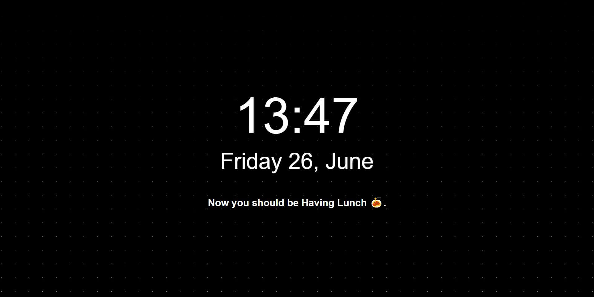

<h2 align="center"> newtab </h2>

  
  
  
   
  

**minimal newtab:** without ads or "Paid" features or tracking.
Built with Preact, Create-React-App and Tailwind.

## My Goals

I need this new tab to be:

- minimal no signups or any other stuff or pro thing ✅
- not use battery if possible ✅
- showcase current time ✅
- showcase my next calendar event
- provide keyboard shortcuts ✅
- provide links to the right tool at the right time based on my routine
  - in the morning - trello
  - after work - workout or running/walking
  - after dinner - trello
  - after work dinner - calendar to log my day
